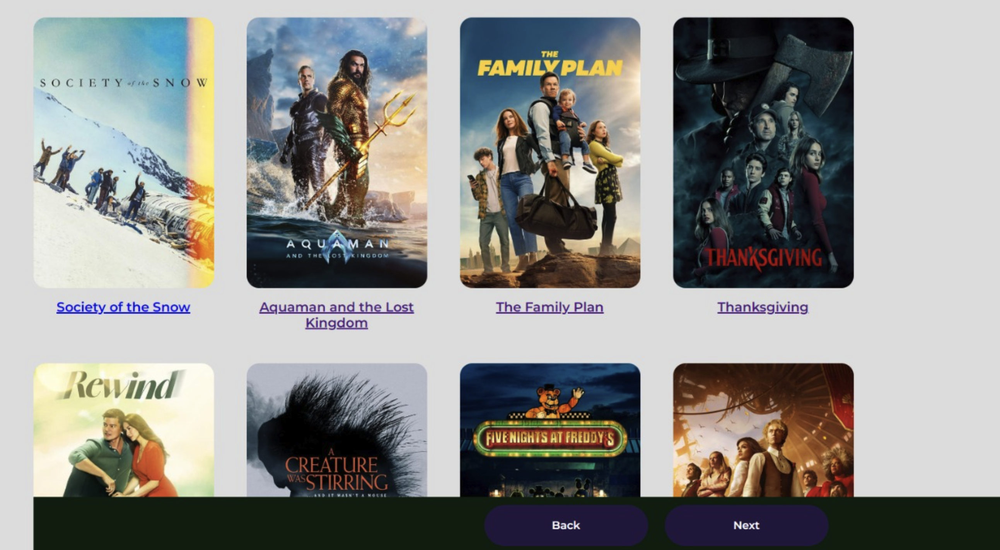
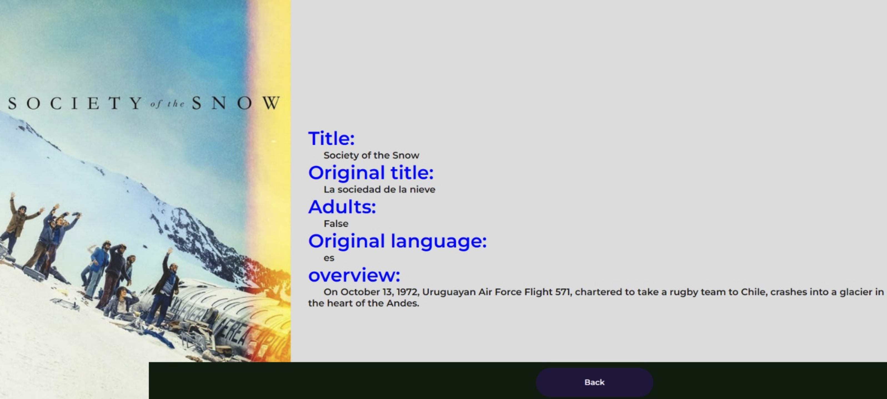

# Capstone

# Movies App with API — Harvard CS50 Web

# Distinctiveness and Complexity

Welcome to the "Movies App with API," an immersive web application designed to provide users with an engaging exploration of the latest movies. By leveraging The Movie Database (TMDb) API, this project excels in delivering an intuitive interface for browsing popular films and accessing comprehensive information.

At its core, the application focuses on simplicity and user engagement, offering a dynamic catalog of the latest movies. The seamless integration of The Movie Database API ensures that the content is consistently up-to-date, presenting users with an extensive selection of films to explore.

The distinctive features of our web application include an intuitive grid layout of movie posters and titles on the main page, immediately capturing the user's attention. To enhance the browsing experience, we've integrated pagination buttons, allowing users to navigate seamlessly through multiple pages of movie results.

Behind the scenes, the application's functionality is achieved by combining a robust back-end built with Python and Django, leveraging HTML5, CSS, and JavaScript for the front-end. Moreover, the mobile and multi-platform responsiveness ensures a user-friendly experience across various devices and browsers.

Explore the captivating world of cinema through our application, where a visually appealing grid of movie posters and titles awaits you. Navigate through pages of movie results effortlessly using the integrated pagination buttons, and delve into the details of your favorite movies with ease.

# File Structure

### Code Organization

The file structure is organized to maintain clarity and modularity. 
Key components include the `ferreteriaWeb` directory, housing the Django project, and the `static` directory containing CSS and JavaScript files responsible for styling and interactivity. 
The `templates` directory holds HTML files defining the structure of the main catalog page (`articulo.html`) and the detailed movie page (`deetall.html`).

## What's contained in each file:

-pictures-master
    -ferreteriaWeb
        -static
            -css
                estilos.css (defines the CSS for the front-end)
            -js
                func.js     (defines javaScript frunctions called in the front-end)
        asgi.py         (ASGI config for ferreteriaWeb project.)
        settings.py     (contains all the configuration of your Django installation)
        urls.py         (URL configuration for ferreteriaWeb project.)
        views.py        (defines functions for the backend called by the URL's)
        wsgi.py         (It exposes the WSGI callable as a module-level variable named  
                        "application".)
    -templates
        articulo.html   (code HTML for the front-end, shows movies catalog)
        deetall.html    (code HTML for the front-end, shows movie detail)
    manage.py           (main function)
    readme.md           (this file) 
    requirements.txt    (dependencies for the project to work, use pip install -r       requirements.txt) 

## Technologies Used

This application harnesses the power of various technologies to deliver a seamless user experience:

- **HTML, CSS, and JavaScript**: Crafting an engaging and responsive front-end.
- **Python and Django**: Powering the back-end and handling server-side operations.
- **The Movie Database (TMDb) API**: Enriching the catalog with real-time movie data.

## Setup

### Installation and Configuration

Setting up the application is straightforward. After cloning the repository, install the necessary dependencies using the `pip install -r requirements.txt` command. Obtain an API key from The Movie Database website and replace `YOUR_API_KEY` in the provided URL.
To run the application, you need to follow these steps:

1. Clone this repository to your local machine
2. Open a terminal or command prompt.
   Navigate to the directory where your requirements.txt file is located.
   Run the following command to install the dependencies: pip install -r requirements.txt
3. Obtain an API key from The Movie Database (TMDb) website https://www.themoviedb.org/
4. Replace YOUR_API_KEY in the following URL https://api.themoviedb.org/3/movie/popular?api_key=YOUR_API_KEY&language=en-US&page= with your own API key
5. Open the index.html file in your web browser
6. Run python3 manage.py runserver command or python if you are on windows

## Usage

Upon running the application, users are welcomed with a visually appealing grid of movie posters and titles on the main page. The pagination buttons facilitate seamless exploration across multiple pages of movie results.
Also by clicking the link under each movie poster you will go to the movie page with details and related information about it as well as similar movies for your information if you are interested.
Make sure to do the setup listed above first.

## Conclusion

In conclusion, the "Movies App with API" is a testament to the fusion of technology and entertainment. By offering a distinctive and user-friendly platform, this project not only provides a dynamic catalog of the latest movies but also ensures that users can dive deep into the details of their favorite films. The integration of The Movie Database API and the thoughtful design choices contribute to the complexity that sets this project apart in the course.

Feel free to explore and enjoy the world of cinema with this application!

## Screenshots of working application

